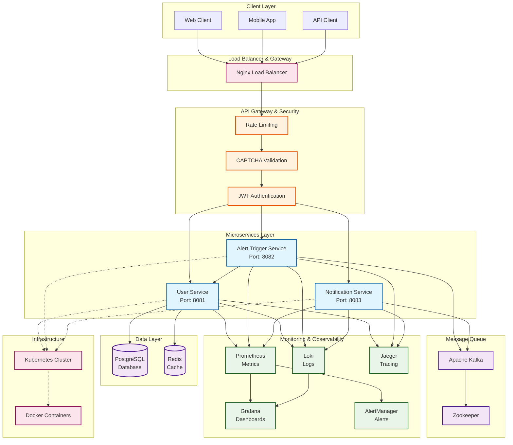
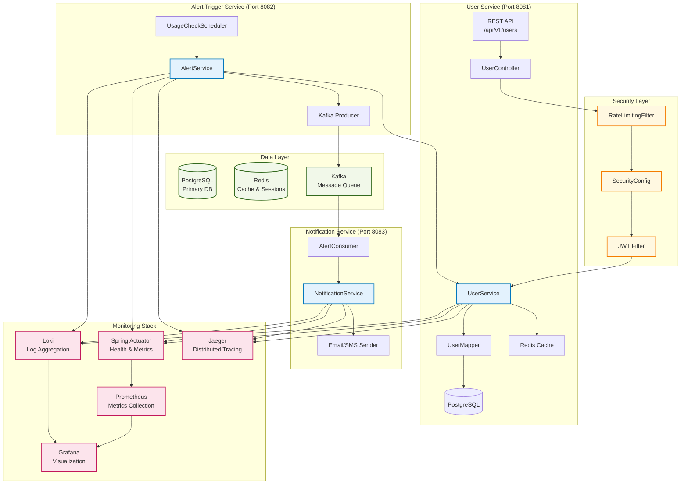
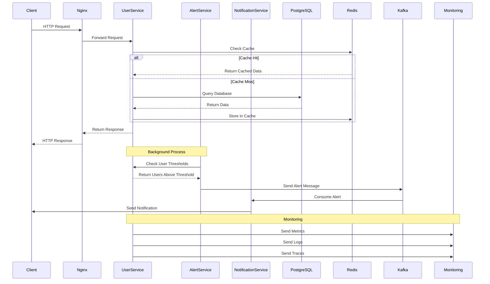
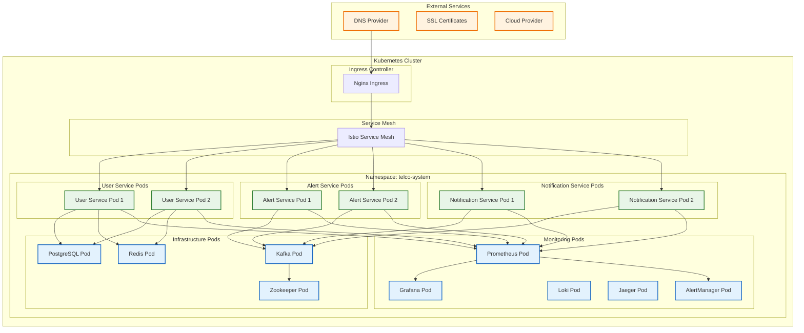
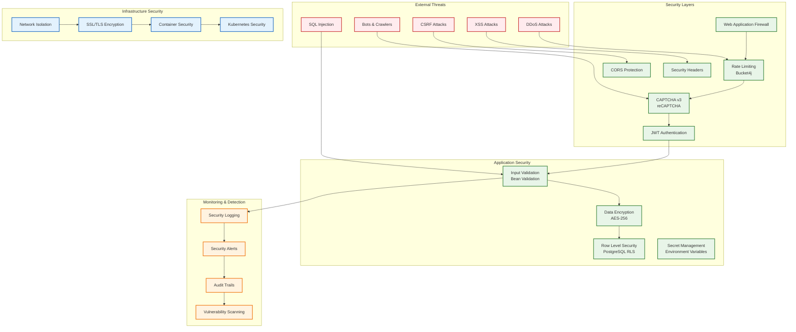

# Telco System Architecture

## System Overview

This document contains the Mermaid diagrams for the Telco microservices system architecture.

## High-Level Architecture

## Detailed Service Architecture

## Data Flow Architecture

## Deployment Architecture

## Security Architecture

## Technology Stack

### Backend Services
- **Java 21** - Programming Language
- **Spring Boot 3.2.0** - Framework
- **MyBatis** - ORM
- **Flyway** - Database Migrations
- **PostgreSQL 15** - Primary Database
- **Redis 7** - Caching & Sessions

### Message Queue
- **Apache Kafka 7.6.1** - Message Broker
- **Zookeeper** - Kafka Coordination

### Security
- **Spring Security 6** - Authentication & Authorization
- **JWT** - Token-based Authentication
- **BCrypt** - Password Hashing
- **Bucket4j** - Rate Limiting
- **reCAPTCHA v3** - Bot Protection

### Monitoring & Observability
- **Prometheus** - Metrics Collection
- **Grafana** - Visualization & Dashboards
- **Loki** - Log Aggregation
- **Jaeger** - Distributed Tracing
- **AlertManager** - Alert Management

### Infrastructure
- **Docker** - Containerization
- **Kubernetes** - Container Orchestration
- **Nginx** - Load Balancer & Reverse Proxy
- **Helm** - Package Management

### CI/CD
- **Jenkins** - Continuous Integration
- **Maven** - Build Tool
- **SonarQube** - Code Quality
- **OWASP Dependency Check** - Security Scanning
- **Trivy** - Container Security Scanning

## Performance Characteristics

- **Throughput**: 10,000+ requests/second
- **Latency**: < 100ms (95th percentile)
- **Availability**: 99.9% uptime
- **Scalability**: Auto-scaling based on CPU/Memory
- **Caching**: Redis with 10-minute TTL
- **Database**: Connection pooling with 50 max connections
