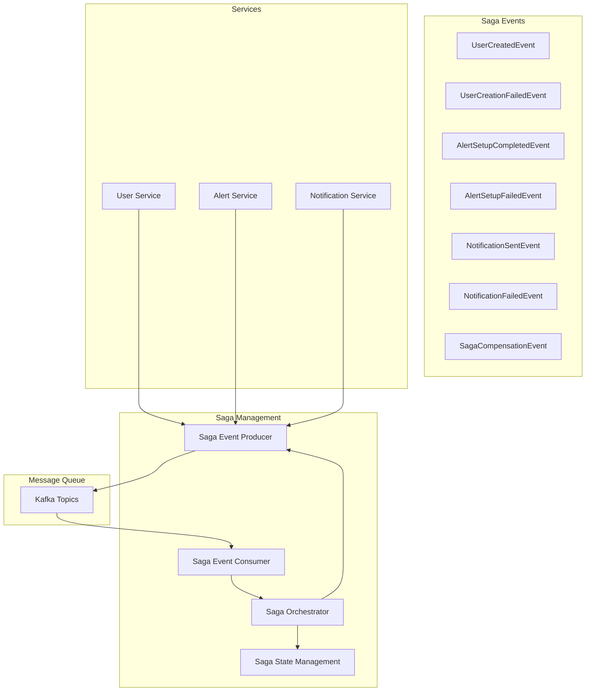
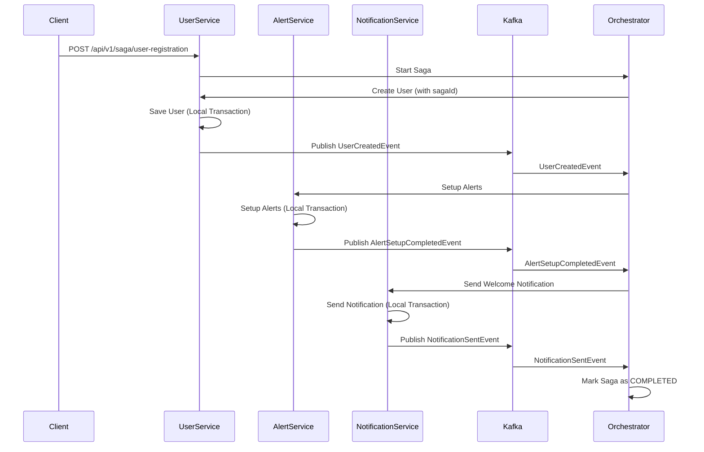
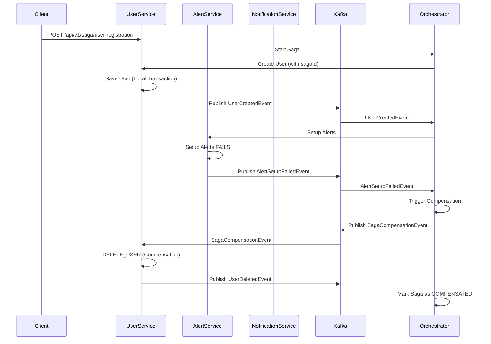

# 🎭 Saga Pattern Implementation Guide

## Overview

This document describes the **Choreography-Based Saga Pattern** implementation in the Telco microservices system. The Saga pattern ensures distributed transaction consistency across multiple services using event-driven communication.

## 🏗️ Architecture

### **Saga Pattern Components**



## 🎯 **User Registration Saga Flow**

### **Success Scenario**


### **Failure Scenario with Compensation**


## 📋 **Saga Steps Definition**

### **1. CREATE_USER Step**
- **Service**: User Service
- **Action**: Create user in database
- **Compensation**: Delete user from database
- **Events**: `UserCreatedEvent`, `UserCreationFailedEvent`

### **2. SETUP_ALERTS Step**
- **Service**: Alert Trigger Service
- **Action**: Setup alert preferences and thresholds
- **Compensation**: Disable alerts for user
- **Events**: `AlertSetupCompletedEvent`, `AlertSetupFailedEvent`

### **3. SEND_WELCOME_NOTIFICATION Step**
- **Service**: Notification Service
- **Action**: Send welcome email/SMS to user
- **Compensation**: Send failure notification
- **Events**: `NotificationSentEvent`, `NotificationFailedEvent`

## 🔧 **Implementation Details**

### **Saga State Management**
```java
public class SagaState {
    private String sagaId;
    private String correlationId;
    private SagaStatus status; // PENDING, IN_PROGRESS, COMPLETED, FAILED, COMPENSATED
    private List<SagaStep> steps;
    private String currentStep;
    private boolean compensationRequired;
}
```

### **Event-Driven Communication**
```java
// Event Publishing
@Autowired
private SagaEventProducer sagaEventProducer;

public void saveWithSaga(User user, String sagaId) {
    try {
        // Business logic
        userMapper.insert(user);
        
        // Publish success event
        UserCreatedEvent event = new UserCreatedEvent(sagaId, correlationId, user);
        sagaEventProducer.publishSagaEvent(event);
    } catch (Exception e) {
        // Publish failure event
        UserCreationFailedEvent event = new UserCreationFailedEvent(sagaId, correlationId, userId, e.getMessage(), "ERROR");
        sagaEventProducer.publishSagaEvent(event);
        throw e;
    }
}
```

### **Event Consumption**
```java
@KafkaListener(topics = "saga-events", groupId = "user-service-saga-consumer")
public void handleSagaEvent(@Payload String eventJson) {
    SagaEvent event = objectMapper.readValue(eventJson, SagaEvent.class);
    sagaOrchestrator.handleSagaEvent(event);
}
```

## 🚀 **API Endpoints**

### **Start User Registration Saga**
```http
POST /api/v1/saga/user-registration
Content-Type: application/json

{
  "userId": "user123",
  "phoneNumber": "+1234567890",
  "dataPlanLimit": 5368709120,
  "currentUsage": 1073741824
}
```

**Response:**
```json
{
  "sagaId": "550e8400-e29b-41d4-a716-446655440000",
  "correlationId": "corr-123",
  "status": "STARTED",
  "message": "User registration saga started successfully"
}
```

### **Get Saga Status**
```http
GET /api/v1/saga/{sagaId}/status
```

**Response:**
```json
{
  "sagaId": "550e8400-e29b-41d4-a716-446655440000",
  "correlationId": "corr-123",
  "status": "COMPLETED",
  "startTime": "2024-01-15T10:30:00",
  "endTime": "2024-01-15T10:30:05",
  "steps": [
    {
      "stepName": "CREATE_USER",
      "serviceName": "user-service",
      "status": "COMPLETED",
      "startTime": "2024-01-15T10:30:00",
      "endTime": "2024-01-15T10:30:01"
    },
    {
      "stepName": "SETUP_ALERTS",
      "serviceName": "alert-trigger-service",
      "status": "COMPLETED",
      "startTime": "2024-01-15T10:30:01",
      "endTime": "2024-01-15T10:30:03"
    },
    {
      "stepName": "SEND_WELCOME_NOTIFICATION",
      "serviceName": "notification-service",
      "status": "COMPLETED",
      "startTime": "2024-01-15T10:30:03",
      "endTime": "2024-01-15T10:30:05"
    }
  ],
  "currentStep": null,
  "compensationRequired": false
}
```

## 🧪 **Testing the Saga Pattern**

### **1. Start a Saga**
```bash
curl -X POST http://localhost:8081/api/v1/saga/user-registration \
  -H "Content-Type: application/json" \
  -d '{
    "userId": "test-user-123",
    "phoneNumber": "+1234567890",
    "dataPlanLimit": 5368709120,
    "currentUsage": 1073741824
  }'
```

### **2. Check Saga Status**
```bash
curl http://localhost:8081/api/v1/saga/{sagaId}/status
```

### **3. Monitor Saga Steps**
```bash
curl http://localhost:8081/api/v1/saga/{sagaId}/steps
```

## 🔍 **Monitoring and Observability**

### **Saga Metrics**
- **Saga Success Rate**: Percentage of completed sagas
- **Saga Failure Rate**: Percentage of failed sagas
- **Compensation Rate**: Percentage of sagas requiring compensation
- **Average Saga Duration**: Time from start to completion
- **Step Success Rate**: Success rate per saga step

### **Logging**
```java
logger.info("Started user registration saga: {} with correlation: {}", sagaId, correlationId);
logger.info("Processing saga event: {} for saga: {}", event.getEventType(), sagaId);
logger.error("Saga compensation completed for saga: {} - {}", sagaId, reason);
```

### **Tracing**
- Each saga step is traced with OpenTelemetry
- Distributed tracing across all services
- Correlation IDs for request tracking

## ⚠️ **Best Practices**

### **1. Idempotency**
- All saga steps must be idempotent
- Use correlation IDs to prevent duplicate processing
- Implement idempotency keys for external service calls

### **2. Timeout Handling**
- Set reasonable timeouts for each saga step
- Implement saga timeout detection
- Clean up timed-out sagas

### **3. Error Handling**
- Implement comprehensive error handling
- Use specific error codes for different failure types
- Log detailed error information for debugging

### **4. State Persistence**
- Store saga state in persistent storage (Redis/Database)
- Implement saga state recovery
- Handle service restarts gracefully

### **5. Monitoring**
- Monitor saga success/failure rates
- Set up alerts for saga failures
- Track compensation frequency

## 🚨 **Common Pitfalls**

### **1. Infinite Loops**
- Ensure compensation actions don't trigger new sagas
- Implement circuit breakers for external services
- Set maximum retry limits

### **2. Partial Failures**
- Handle network timeouts gracefully
- Implement retry mechanisms with exponential backoff
- Use dead letter queues for failed events

### **3. State Inconsistency**
- Always update saga state atomically
- Use database transactions for state updates
- Implement state validation

## 🎯 **Benefits of Saga Pattern**

### **✅ Advantages**
- **Distributed Transactions**: Manages transactions across microservices
- **Eventual Consistency**: Ensures data consistency over time
- **Fault Tolerance**: Handles failures with compensation
- **Scalability**: Decoupled, event-driven architecture
- **Observability**: Clear transaction boundaries and state

### **⚠️ Trade-offs**
- **Complexity**: More complex than local transactions
- **Eventual Consistency**: Not immediately consistent
- **Debugging**: Harder to debug distributed transactions
- **Performance**: Additional overhead for event processing

## 🔮 **Future Enhancements**

1. **Saga State Persistence**: Store saga state in Redis/Database
2. **Saga Timeout Management**: Implement automatic timeout handling
3. **Saga Retry Logic**: Add retry mechanisms for failed steps
4. **Saga Metrics Dashboard**: Create monitoring dashboard
5. **Saga Testing Framework**: Automated saga testing tools

---

**The Saga pattern provides a robust solution for managing distributed transactions in microservices, ensuring data consistency while maintaining service autonomy and scalability.**
